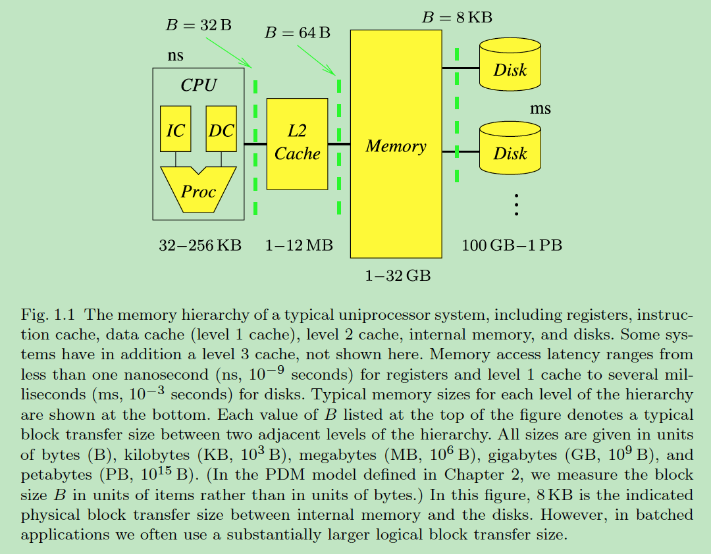
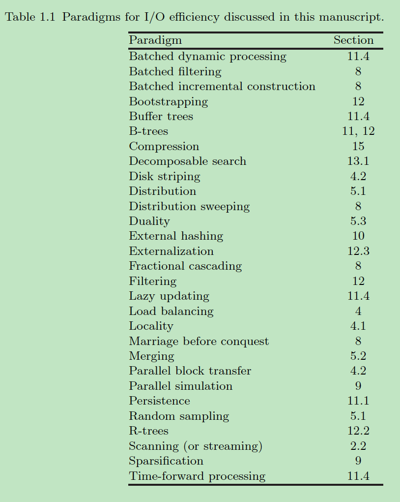
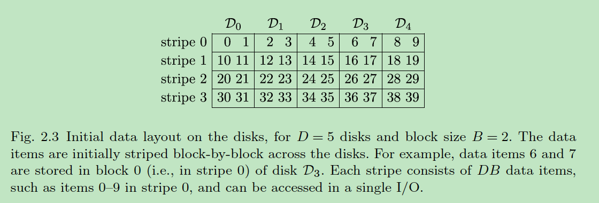
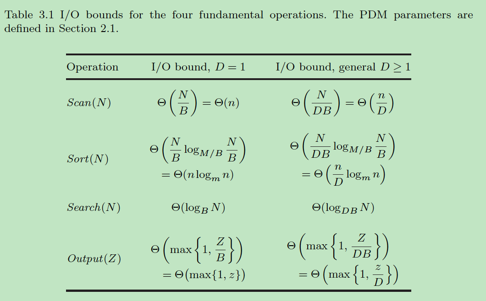

# Notes of Algorithms and data structures for external memory

|时间|内容|
|:---|:---|
|20190426|kick off to play with the defined outline.<br/>TODO(zhoujiagen) after reading Knuth’s TACP vol3|

<!--
Purugganan M, Hewitt J. How to read a scientific article[J]. Rice University, 2004.

IMRD structure: Introduction, Methods, Results, and Discussion.

Before and during your reading, ask yourself these questions:
• Who are these authors? What journal is this? Might I question the credibility of the work?
• Have I taken the time to understand all the terminology?
• Have I gone back to read an article or review that would help me understand this work better?
• Am I spending too much time reading the less important parts of this article?
• Is there someone I can talk to about confusing parts of this article?

After reading, ask yourself these questions:
• What specific problem does this research address? Why is it important?
• Is the method used a good one? The best one?
• What are the specific findings? Am I able to summarize them in one or two sentences?
• Are the findings supported by persuasive evidence?
• Is there an alternative interpretation of the data that the author did not address?
• How are the findings unique/new/unusual or supportive of other work in the field?
• How do these results relate to the work I’m interested in? To other work I’ve read about?
• What are some of the specific applications of the ideas presented here? What are some further experiments that would answer remaining questions?
 -->


## 引用

<!--
Author(s), Date of publication, Title (book or article), Journal,Volume #, Issue #, pages:
If web access: url; date accessed
-->

```
@Article{vitter2008algorithms,
  author    = {Vitter, Jeffrey Scott and others},
  title     = {(外存算法和数据结构)Algorithms and data structures for external memory},
  journal   = {Foundations and Trends{\textregistered} in Theoretical Computer Science},
  year      = {2008},
  volume    = {2},
  number    = {4},
  pages     = {305--474},
  file      = {:Algorithms and Data Structures for External Memory Vit.IO Book.pdf:PDF},
  groups    = {RDB},
  publisher = {Now Publishers, Inc.},
}
```

## 关键字

- EM: external memory
- EM paradigms
- batched problem
- online problem
- PDM: Parallel Disk Model
- disk strpping
- TPIE: Transparent Parallel I/O programming Environment


## 主题

<!-- General subject, Specific subject -->

Alogrithm and Data Structure, Analysis of Algorithm

## 假设

> Data sets in large applications are often too massive to fit completely inside the computer's internal memory. The resulting input/output communication (or I/O) between fast internal memory and slower external memory (such as disks) can be a major performance bottleneck.

## 方法论

survey: the state of the art in the design and analysis of algorithms and data structures for external memory(EM)

goal: 利用局部性和并行性, 减少IO操作. exploit the locality and parallelism in order to reduce the I/O costs

model:

- 提供分析算法和数据结构性能的模型

PDM provides an elegant and reasonably accurate model for analyzing the relative performance of EM algorithms and data structures.

- 考察的性能指标: (并行)IO操作的数量, 使用的磁盘空间, (并行)CPU时间

The three main performance measures of PDM are the number of (parallel) I/O operations, the disk space usage, and the (parallel) CPU time. For reasons of brevity, we focus on the first two measures.

## 结果

The newly developed EM algorithms and data structures that incorporate the paradigms we discuss are significantly faster than other methods used in practice.

## 关键点总结

<!--
Document level
• Title
• Abstract
• Keywords
• visuals (especially figure and table titles)
• first sentence or the last 1-2 sentences of the Introduction

Paragraph level: words or phrases to look for
• surprising
• unexpected
• in contrast with previous work
• has seldom been addressed
• we hypothesize that
• we propose
• we introduce
• we develop
• the data suggest
-->

### 文章结构

### 术语

### batched, online problems

batched problems: 不经过预处理, 必须处理整个数据文件.

sorting, permuting, fast Fourier transform(FFT), matrices(triangulation), geometric data(convex hull), graphs

paradigms: distribution, merging, disk striping

online problems: 计算作为一系列连续查询的响应.
被查询的数据可以是: (1) 静态的, 可以预处理以支持高效查询; (2) 动态的, 查询和更新同时进行.

dictionary lookup, range searching, stabbing searching

indexed data structure: extendible hashing, B-trees

paradigms: filtering, bootstrapping

### PDM

parallel disk model, 并行磁盘模型

latency for accessing data: seek time + rotational latency

主要参数:

- N = problem size (in units of data items); n = N/B
- M = internal memory size (in units of data items); m = M/B
- B = block transfer size (in units of data items);
- D = number of independent disk drives;
- P = number of CPUs,

性能参数:

- Q = number of queries (for a batched problem);  q = Q/B
- Z = answer size (in units of data items). z = Z/B

简化假设: D个磁盘上的D个块的传输是同步的(synchronous)

### 基础I/O操作

(1) 扫描: Scanning (a.k.a. streaming or touching) a file of N data items, which involves the sequential reading or writing of the items in the file.

(2) 排序: Sorting a file of N data items, which puts the items into sorted order.

(3) 搜索: Searching online through N sorted data items.

(4) 输出: Outputting the Z items of an answer to a query in a blocked “output-sensitive” fashion.

###局部性和负载均衡

locality, load balancing

batched:  $\Omega (N \log n)$ => $O(n \log_mn)$

online:  $\Omega (\log N + z)$ => $O(\log_BN + z)$

disk striping: 一次读取一个stripe(见 Fig. 2.3)

可用于优化IO操作(1, 3, 4), 不能优化排序(2)

### 外部排序

$Sort(N) = \Theta \left ( \frac{n}{D} \log_mn \right )$

TODO(zhoujiagen) after reading Knuth’s TACP vol3

sorting by distribution
sorting by merging


tool and environment


## 上下文

<!-- how this article relates to other work in the field; how it ties in with key issues and findings by others, including yourself -->

## 意义

<!-- Significance to the field; in relation to your own work -->

## 重要的图表

<!-- brief description; page number -->

### Fig. 1.1 单处理器系统的内存层次



### Table 1.1 文中讨论的IO场景



### Fig. 2.3 初始时磁盘上数据布局



### Table 3.1 4个基础操作的I/O界限



## 引用的重要文献

<!-- cite those obviously related to your topic AND any papers frequently cited by others because those works may well prove to be essential as you develop your own work -->

[138, 220] Demuth
开始研究EM设备的问题复杂性和算法分析

[220] Knuth
深入研究磁带和磁盘的外部排序

[165, 220] Floyd
磁盘上排序和矩阵转置的IO理想上界和下界

[24, 155, 195, 265]
数据流一趟算法, 近似

[20, 21, 344, 346]
层次内存模型

cache-oblivious algorithms: [168], [79][80], [33]
https://en.wikipedia.org/wiki/Cache-oblivious_algorithm


## 其他备注
