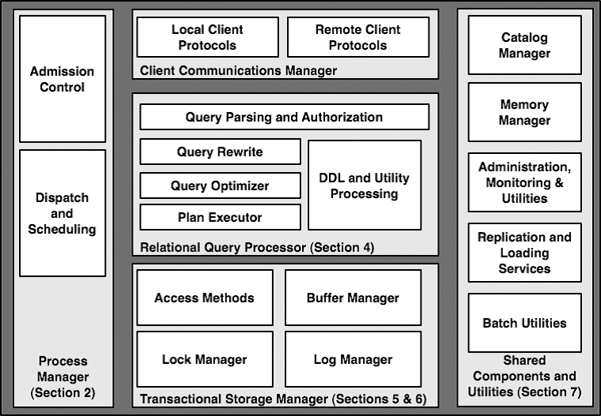
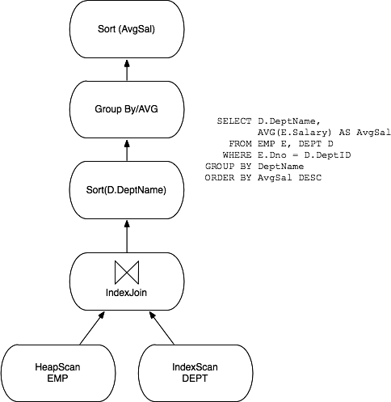

# Notes of **Architecture of a Database System**

|时间|内容|
|:---|:---|
|2022-02-10| kick off. |
|2022-02-11| reading section 1,2,3. |
|2022-02-14| reading section 4,5,6,7,8. |

<!--
Purugganan M, Hewitt J. How to read a scientific article[J]. Rice University, 2004.

IMRD structure: Introduction, Methods, Results, and Discussion.

Before and during your reading, ask yourself these questions:
• Who are these authors? What journal is this? Might I question the credibility of the work?
• Have I taken the time to understand all the terminology?
• Have I gone back to read an article or review that would help me understand this work better?
• Am I spending too much time reading the less important parts of this article?
• Is there someone I can talk to about confusing parts of this article?

After reading, ask yourself these questions:
• What specific problem does this research address? Why is it important?
• Is the method used a good one? The best one?
• What are the specific findings? Am I able to summarize them in one or two sentences?
• Are the findings supported by persuasive evidence?
• Is there an alternative interpretation of the data that the author did not address?
• How are the findings unique/new/unusual or supportive of other work in the field?
• How do these results relate to the work I’m interested in? To other work I’ve read about?
• What are some of the specific applications of the ideas presented here? What are some further experiments that would answer remaining questions?
 -->


## 引用

<!--
Author(s), Date of publication, Title (book or article), Journal,Volume #, Issue #, pages:
If web access: url; date accessed
-->

```
@Article{Hellerstein2007a,
  author    = {Joseph M. Hellerstein and Michael Stonebraker and James Hamilton},
  journal   = {Foundations and Trends{\textregistered} in Databases},
  title     = {Architecture of a Database System},
  year      = {2007},
  number    = {2},
  pages     = {141--259},
  volume    = {1},
  doi       = {10.1561/1900000002},
  priority  = {prio1},
  publisher = {Now Publishers},
}
```

## 关键字

## 主题

<!-- General subject, Specific subject -->

## 假设

assumption on readers:

- familiar with textbook database systems materials (`[72]`, `[83]`),
- familiar with the basic facilities of moder operating systems.


focus on relational database systems throughout this paper.

## 方法论

attempt to capture the main architectural aspects of modern database systems, with a discussion of advanced topics.

## 结果

## 关键点总结

<!--
Document level
• Title
• Abstract
• Keywords
• visuals (especially figure and table titles)
• first sentence or the last 1-2 sentences of the Introduction

Paragraph level: words or phrases to look for
• surprising
• unexpected
• in contrast with previous work
• has seldom been addressed
• we hypothesize that
• we propose
• we introduce
• we develop
• the data suggest
-->

### 文章结构

```
1 Introduction                                              1
1.1 Relational Systems: The Life of a Query                 2
1.2 Scope and Overview                                      7

2 Process Models                                            9
2.1 Uniprocessors and Lightweight Threads                   12
2.2 DBMS Threads                                            19
2.3 Standard Practice                                       20
2.4 Admission Control                                       22
2.5 Discussion and Additional Material                      24

3 Parallel Architecture: Processes and Memory Coordination  25
3.1 Shared Memory                                           25
3.2 Shared-Nothing                                          27
3.3 Shared-Disk                                             30
3.4 NUMA                                                    31
3.5 DBMS Threads and Multi-processors                       32
3.6 Standard Practice                                       33
3.7 Discussion and Additional Material                      34

4 Relational Query Processor                                37
4.1 Query Parsing and Authorization                         38
4.2 Query Rewrite                                           40
4.3 Query Optimizer                                         43
4.4 Query Executor                                          49
4.5 Access Methods                                          54
4.6 Data Warehouses                                         57
4.7 Database Extensibility                                  63
4.8 Standard Practice                                       68
4.9 Discussion and Additional Material                      69

5 Storage Management                                        71
5.1 Spatial Control                                         71
5.2 Temporal Control: Buffering                             73
5.3 Buffer Management                                       75
5.4 Standard Practice                                       77
5.5 Discussion and Additional Material                      77

6 Transactions: Concurrency Control and Recovery            79
6.1 A Note on ACID                                          80
6.2 A Brief Review of Serializability                       81
6.3 Locking and Latching                                    83
6.4 Log Manager                                             89
6.5 Locking and Logging in Indexes                          92
6.6 Interdependencies of Transactional Storage              96
6.7 Standard Practice                                       98
6.8 Discussion and Additional Material                      99

7 Shared Components                                         101
7.1 Catalog Manager                                         101
7.2 Memory Allocator                                        102
7.3 Disk Management Subsystems                              105
7.4 Replication Services                                    107
7.5 Administration, Monitoring, and Utilities               109

8 Conclusion                                                113

Acknowledgments                                             115

References                                                  117
```

### 术语

- DBMSs: Database Management Systems
- RDBMSs: Relational DBMSs

### 摘要

### 1 Introduction
#### 1.1 Relational Systems: The Life of a Query

see Fig. 1.1

#### 1.2 Scope and Overview

scope:

- focus on architectural fundamentals supporting core database functionality.
- not attemp to provide a comprehensive review of database algorithms.
- provide only minimal discussion of many extensions present in modern DBMSs

structure:

- overall process structure: uniprocessor machines, parallel architectures,
- a single query's view of the system,
- the storage architecture and transactional storage management design,
- shared components and utilities exists in most DBMS.

### 2 Process Models

definitions:

- **Operating System Process**: combines an operating system (OS) program execution unit (a thread of control) with an address space private to the process.
- **Operating System Thread**: an OS program execution unit without additnal private OS context and without a private address space.
- **Lightweight Thread(LWT) Package**: an application-level construct that supports multiple thread within a single OS process.
- **DBMS threads**: some DBMS implment their own LWT packages.
- **DBMS Client**: the software component that implements the API used by application program to communicate with a DBMS.
- **DBMS Worker**: the thread of execution in the DBMS that does work on behalf of a DBMS Client.

#### 2.1 Uniprocessors and Lightweight Threads

process model options:

- processor per DBMS Worker
- thread per DBMS Worker
- process pool

shared data and process boundaries:

- all SQL requests need to be moved into the server processes, and
- all results for return to the client need to be moved back out.

they use buffers:

- disk I/O buffers,
- client communication buffers.

#### 2.2 DBMS Threads

it was not until the 1990s that OS treads were widely implemented, and where they dis exist, the implementations varied greatly.

#### 2.3 Standard Practice

|process model option         | IBM DB2 | MySQL | Oracle | PostgreSQL | Microsoft SQL Server|
|:---                         |:---     |:---   |:---    |:---        |:---                 |
|Process per DBMS worker      |    Y    |       |   Y    |     Y      |                     |
|**Thread per DBMS worker**   |
|OS thread per DBMS worker    |    Y    |   Y   |        |            |                     |
|DBMS thread per DBMS worker  |         |       |        |            |         Y           |
|**Process/thread pool**      |
|process pool                 |    Y    |       |   Y    |            |                     |
|thread pool                  |    Y    |       |        |            |         Y           |

#### 2.4 Admission Control

any good multi-user system has an **admission control policy**, which does not accept new work unless sufficient DBMS resources are available.

with a good admission controller, a system will display graceful degradation under overload.

#### 2.5 Discussion and Additional Material

### 3 Parallel Architecture: Processes and Memory Coordination
#### 3.1 Shared Memory
#### 3.2 Shared-Nothing
#### 3.3 Shared-Disk
#### 3.4 NUMA

NUMA: Non-Uniform Memory Access

- each system in the cluster can access its own local memory quickly, whereas
- remote memory access across the high-speed cluster interconnect is somewhat delayed.

#### 3.5 DBMS Threads and Multi-processors
#### 3.6 Standard Practice

|parallel architecture  | IBM DB2 | MySQL | Oracle | PostgreSQL | Microsoft SQL Server|
|:---                   |:---     |:---   |:---    |:---        |:---                 |
|Shared-Memory          |    Y    |       |    Y   |            |          Y          |
|Shared-Nothing         |    Y    |       |        | Greenplum  |                     |
|Shared-Disk            | ZSeries |       |  RAC   |            |                     |

#### 3.7 Discussion and Additional Material

### 4 Relational Query Processor

1. a relational query processor takes a decalrative SQL statement, validates it,
2. optimizes it into a procedural dataflow execution plan, and
3. executes that dataflow program on behalf of a client program.
4. the client program then feteches/pulls the result tuples, typically one at a time or in small batches.

major components:

- query parsing and authorization
- query rewrite
- query optimizer
- plan executor
- DDL and utility processing

in general, relational query processing can be viewed as a single-user, single-thread task, except when the DBMS must explicitly **pin/unpin** buffer pool pages so that they remain resident in memory.

focus on DML(Data Manipulation Language): `SELECT`, `INSERT`, `UPDATE`, `DELETE`.

#### 4.1 Query Parsing and Authorization

given an SQL statement, the main taks for the SQL parser:

1. check that the query is correctly specified,
2. resolve names and references,
3. convert the query into the internal format used by the optimizer,
4. verify that the user is authorized to execute the query.

canonicalize table names: `server.database.schema.table`

#### 4.2 Query Rewrite

simplifying and normalizing the query without changing its semantics.

usually output an internal representation of the query in the same internal format that it accepted as its input.

main responsibilities:

- view expansion

- constant arithmetic evaluation: `R.x < 10+2+R.y` => `R.x < 12+R.y`

- logical rewriting of predicates: `NOT Emp.Salary > 1000000` => `Emp.Salary <= 1000000`, `Emp.Salary < 75000 AND Emp.Salary > 1000000` => `FALSE`, `R.x < 10 AND R.x = S.y` => add `AND S.y < 10`

- semantic optimization: redundant join elimination

``` sql
-- foreign key constraint: Emp.deptno -> Dept.dno
SELECT Emp.name, Emp.Salary
FROM Emp, Dept
WHERE Emp.deptno = Dept.dno

-- =>
SELECT Emp.name, Emp.Salary
FROM Emp
```

- subquery flattening and other heuristic rewrites

> PRECONDITION: to keep complexity of optimization bounded, most optimizer operate on individual `SELECT-FROM-WHERE` query blocks in isolation and do not optimize across blocks.

**query normalization**: rewrite quries into a form better suited for the optimizer, examples:

(1) rewrite semantically equivalent queries into **a canonical form**, in an effor to ensure that semantically equivalent queries whill be optimized to produce that same query plan.

(2) **flatten nested queries** when possible to maximally expose opportunities for the query optimizer's single-block optimization

#### 4.3 Query Optimizer

responsibility: transform an internal query representation in to an efficient **query plan** for exuecuting the query.

a **query plan** can be thought of as **a dataflow diagram** that pipes table data through a graph of **query operators**.

to enable cross-platform portability, every major DBMS new compiles queries into some kind of interpretable data structures:

- a very lightweight object, not unlike a relational algebraic expression,
- a lower-level language of op-codes


extensions to System R optitizer:

- plan space

left-deep query plans -> bushy trees with nested right-hand inputs

postponing Cartesian products -> early use of Cartesian products

- selectivity estimation

simple table and index cardinalities -> distribution of values in attributes via histograms and other summary statistics

- search algorithms

dynamic programming optimization approach -> a goal-directed top-down search scheme, heuristic search schemes

- parallelism

-> parallel processing, intra-query parallelism

- auto-tuning

-> the ability of a DBMS to make tunning decisions automatically

#### 4.4 Query Executor

the query executor operates on a fully-specified query plan.

representation of query plan:

- a directed dataflow graph: connect operators that encapsulate base-table access and various query execution algorithms. - focus
- low-level op-codes

the **iterator** model:

``` c++
class iterator {
  iterator &inputs[];
  void init();
  tuple get_next();
  void close();
};
```

all operators in a query plan are implemented as subclasses of the `iterator` class:

- file scan
- index scan
- sort
- nested loop join
- merge join
- hash join
- duplicate elimination
- grouped aggregation

> example: PostgreSQL

##### 4.4.1 Iterator Discussion

iterators couple data flow iwth control flow.

a single DBMS thread is needed to execute an entire query graph.

##### 4.4.2 Where's the Data?

how tuples were stored in memory? how the were passed between iterators?

**tuple descriptors**:

- each iterator is pre-allocated a fixed number of tuple descriptors, one for each of its inputs or output,
- a tuple descriptor is **an array of column references**, where each column reference is composed of a reference to a tuple somewhere else in memory, and a column offset in that tuple.


(1) BP-tuples

tuples reside in pages in the buffer pool

(2) M-tuple

allocate space for a tuple on the memory heap

##### 4.4.3 Data Modification Statements

`INSERT`, `DELETE`, `UPDATE` statements

halloween probleam: give everyone whose salary is under $20K at 10% raise.

> SQL semantics: a single SQL statement is not allowed to "see" its own updates.

``` sql
UPDATE EMP
SET Salary = Salary * 1.1
WHERE Salary < 20000
```

#### 4.5 Access Methods

**access methods** are the **routines** that manage access to the various disk-based data structures that the system supports. include unordered files(heaps), various kinds of indexes.

the basic API:

``` c++
// iterator
void init(search-argument);
tuple get_next();
```

ways to **point** to rows in a base table:

- RIDs: direct row IDs, physical disk addresses of the rows in the base tables,
- use the row primary key: avoid the problems that row movement causes.

access methods have deep interactions with the concurrency and recovery logic surrounding transactions.

#### 4.6 Data Warehouses

Warehouses deal with history, OLTP deals with "now".

##### 4.6.1 Bitmap Indexes

situation: data warehouses often have columns with a small number of values,

example: the sex of a customer. this can be represented by one bit per record in a bitmap.

bitmaps are advantageous for conjunctive filters:

``` sql
-- intersecting bitmaps to determine the result set
Customer.sex = "F" and Customer.state = "California"
```

##### 4.6.2 Fast Load

bulk-loadable warehouse

"real time" warehouse: avoid update-in-place, provide historical queries.

##### 4.6.3 Materialized Views

materialized views take are actual tables taht can be queries, but which correspond to a logical view expression over the true base data tables. the materialzied view must be kept up to date as updates are performed.

3 aspects for usage:

- (a) selecting the views to materialzie,
- (b) maintainning the freshness of the views,
- (c) considering the use of materialized views in ad-hoc queries.

##### 4.6.4 OLAP and Ad-hoc Query Support

ad-hoc queries: formulated on the fly by business analysts.

OLAP: on-line analytical processing.

##### 4.6.5 Optimization of Snowflake Schema Queries

**star schema**:

- facts: "customer X bought product Y from store Z at time T"
- central fact table: records information about each fact, such as the purchase price, discount, sales tax information, etc.
- also in the fact table are foreign keys for each **dismensions**, including customers, products, stores, time, etc.

**snowflake schema**: multi-level star.

##### 4.6.6 Data Warehousing: Conclusions

#### 4.7 Database Extensibility

> Relational databases have traditionally been viewed as being limited in the kinds of data they store, focused mostly on the "facts and figures" used in corporate and administrative record-keeping.


##### 4.7.1 Abstract Data Types

extensible to new abstract data types (ADT) at runtime, the DBMS type system has to be driven from the system catalog, which maintains the list of types known to the system, and pointers to the methods used to manipulate the types.

##### 4.7.2 Structured Types and XML

non-relationsal structured types:

- nested collection types: arrays, sets, trees,
- nested tuples,
- nested relations.

3 approaches to handling structured types like XML:

1. build a custom database system that operates on data with structured types;
2. treat the complex type as an ADT;
3. normalize the nested structure into a set of relations upon insertion, with foreign keys connecting sub-objects to their parents.

##### 4.7.3 Full-Text Search

an inverted file relation with tuples `(word, documentID, position)`.

##### 4.7.4 Additional Extensibility Issues

- extensible query optimizer;
- the ability for the database to wrap remote data sources within the schema as if they were native tables, and access them during query processing.

#### 4.8 Standard Practice

coarse architecture: similar to the System R prototype

in the open source arena: PostgreSQL, MySQL.

#### 4.9 Discussion and Additional Material

### 5 Storage Management

2 basic types of DBMS storage managers in commercial use:

- (1) the DBMS interacts directly with the low-level block mode device drivers for the disks: caw-mode access, or
- (2) the DBMS uses standarad OS file system facilities.

#### 5.1 Spatial Control

> The best way for the DBMS to control spatial locality of its data is to store the data directly to the "raw" disk device and avoid the file system entirely.

> An alternative to raw disk access is for the DBMS to create a very large file in the OS file system, and to manage positioning of data as offsets in that file.


customly set the database page size to a size appropriate for the exprected work load.

#### 5.2 Temporal Control: Buffering

> In addition to controlling **where** on the disk data should be placed, a DBMS must control **when** data gets physically written to the disk.

most OS file systems provide built-in **I/O buffering mechanisms** to decide when to do reads and writes of file blocks.

most OS files system typically have some built-in support for **read-ahead** (speculative reads) and **write-behind** (delayed, batched writes).

#### 5.3 Buffer Management

> In order to provide  access to database pages, every DBMS implements a large shared buffer pool in its own memory space.

#### 5.4 Standard Practice
#### 5.5 Discussion and Additional Material

### 6 Transactions: Concurrency Control and Recovery

the truly monolithic piece of a DBMS is the transactional storage manager that typically encompasses 4 deeply interwinded components:

1. a lock manager for concurrency control,
2. a log manager for recovery,
3. a buffer pool for staging database I/Os,
4. access methods for organizing data on disk.

#### 6.1 A Note on ACID
#### 6.2 A Brief Review of Serializability

**serializability** is the well-defined textbook notion of correctness fro concurrent transactions.

> It dictates that a sequence of interleaved actions for multiple committing transactions must correspond to some serial executions of the transactions - as though there were no parallel execution at all.

> A transaction is said to execute in isolation if it does not see any concurrency anomalies.

3 broad techniques of concurrency control enforment:

- S2PL (Strict two-phase locking),
- MVCC (Multi-Version Concurrency Control),
- OCC (Optimistic Concurrency Control).

#### 6.3 Locking and Latching

lock manager support 2 basic calls:

```
lock(lockname, transactionID, mode)
remove_transaction(transactionID)

unlock(lockname, transactionID)
lock_upgrade(lockname, transactionID, newmode)
conditional_lock(lockname, transactionID, mode)
```

lock manager maintains 2 data structures:

- **a global lock table**: a dynamic hash table keyed by lock names, associated with each lock is a **mode flag** to indicate the lock mode, and a **wait queue** of lock request pairs `(tansactionID, mode)`
- **a transaction table**: keyed by transactionID, which contains 2 items for each transaction T, (1) a pointer to T's DBMS thread state, (2) a list of pointers to all of T's lock requests in the lock table.

a deadlock detector DBMS thread

lighter-weight **latches** are used to provide exclusive access to internal DBMS data structures, for example, the buffer pool page table has a latch associated with each frame, to guarantee that only one DBMS thread is replacing a given frame at any time.

latch API:

```
latch(object, mode)
unlantch(object)
conditional_latch(object, mode)
```

> distinguish between locks and latches.

##### 6.3.1 Transaction Isolation Levels

ANSI SQL standard defines 4 isolation levels:

1. READ UNCOMMITTED
2. READ COMMITTED
3. REPEATABLE READ
4. SERIALIZABLE

vendors provides isolation levels:

- CURSOR STABILITY
- SNAPSHOT ISOLATION
- READ CONSISTENCY

#### 6.4 Log Manager

the log manager is responsible for:

- maintaining the durability of committed transactions,
- facilitating the rollback of aborted transaction to ensure atomicity,
- recovering from system failure or non-orderly shutdown.

a Write-Ahead Logging (WAL) protocol

challenge is to guarantee efficiency in the fast path for transactions that commit, while also providing high-performance rollback for aborted transaction, and quick recovery after crashes.

#### 6.5 Locking and Logging in Indexes

> The only invariant that index concurrency and recovery needs to preserve is that the index always returns transactionally consistent tuples from the database.

##### 6.5.1 Latching in B+-Trees

key insight: modifications to the tree's physical structure can be made in a non-transactional manner as long as all concurrent transactions continue to find the correct data at the leaves.

3 approaches:

1. conservative schemes,
2. latch-coupling schemes,
3. right-link schemes.

##### 6.5.2 Logging for Physical Structures

> The main idea is that structural index changes need not be undone when the associated transaction is aborted; such changes can often have no effect on the database tuples seen by other transactions.

##### 6.5.3 Next-Key Locking: Physical Surrogates for Logical Properties

the phantom problem

next-key locking in B+-trees: an insertion of a tuple with index key k must allocate an exclusive lock on the next-key tuple that exists in the index, where the next-key tuple has the lowest key greater than k.

next-key locking is an example of using a physical object (a currently-storead tuple) as a surrogate for a logical concept (a predicate).

#### 6.6 Interdependencies of Transactional Storage

discuss a few of the interdependencies between the 3 main aspects of a transactional storage system: concurrency control, recovery management, access methods.

#### 6.7 Standard Practice

PostgreSQL: use MVCC

#### 6.8 Discussion and Additional Material

### 7 Shared Components
#### 7.1 Catalog Manager

the database catalog holds information about data in the system and is a form of metadata.

#### 7.2 Memory Allocator

context-based memory allocator: more efficient and easier to debug.

#### 7.3 Disk Management Subsystems

in practice, disk drives are complex and heterogeneous pieces of hardware that vary widely in capacity and bankwidth.

#### 7.4 Replication Services

3 typical schemes for replication:

1. physical replication,
2. trigger-based replication,
3. log-based replication.

#### 7.5 Administration, Monitoring, and Utilities

utilities:

- optimizer statistics gathering
- physical reorganization and index construction
- backup, export
- bulk load
- monitroing, tuning, resource governers.

### 8 Conclusion


## 上下文

<!-- how this article relates to other work in the field; how it ties in with key issues and findings by others, including yourself -->

## 意义

<!-- Significance to the field; in relation to your own work -->

while many of the algorithms and abstractions used by a DBMS are textbook material, there has been relatively sparse coverage in the literature of the systems desion issues that make a DBMS work.

this paper presents **an architecture discussion of DBMS design principles**, including:

- process models,
- parallel architecture,
- storage system design,
- transaction system implementation,
- query processor and optimizer architectures,
- typical shared components and utilities.

relation to my work: 帮助建立数据库管理系统的体系结构的基本概念.

## 重要的图表

<!-- brief description; page number -->

### Fig. 1.1 Main components of a DBMS



example: a gate agent clicks on a form to request the passenger list for a flight

1. Client Communications Manager
2. Process Manager
3. Relational Query Processor
4. Transactional Storage Manager
5. unwinding the stack

a number of shared components and utilities that are vital to the operation of a full-function DBMS

### Fig. 4.1 A Query plan. Only the main physical operators are shown.



``` sql
SELECT D.DeptName,
  AVG(E.Salary) AS AvgSal
FROM Emp E, DEPT D
WHERE E.Dno = D.DeptID
GROUP BY DeptName
ORDER BY AvgSal DESC
```

## 引用的重要文献

<!-- cite those obviously related to your topic AND any papers frequently cited by others because those works may well prove to be essential as you develop your own work -->

System R optimizer: `[79]`

query potimization short survy: `[10]`

query execution survey: `[24]`

bitmap processing: `[65]`

ARIES: `[59]`

Principles of transaction-oriented database recovery: `[34]`

## 其他备注
