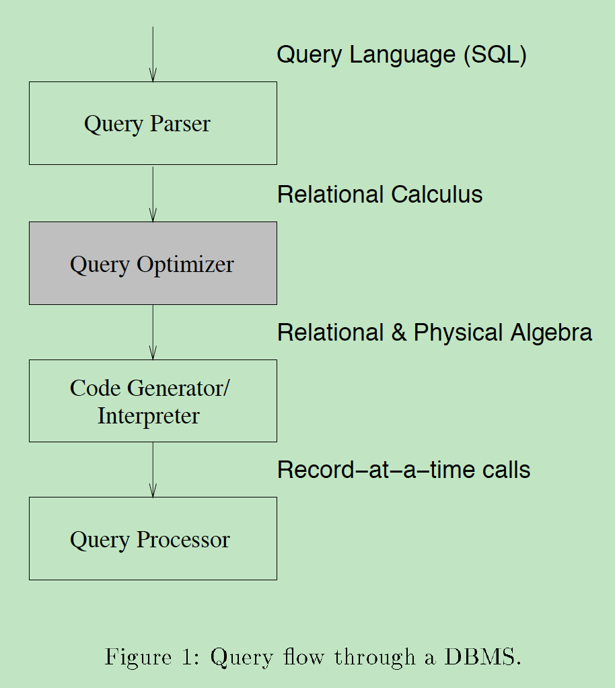
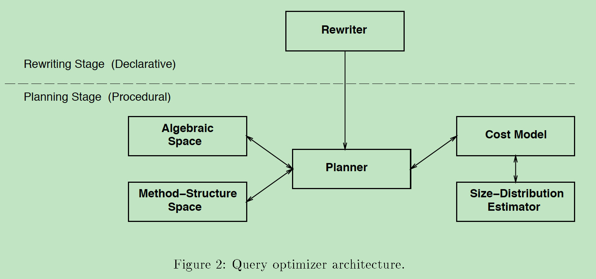
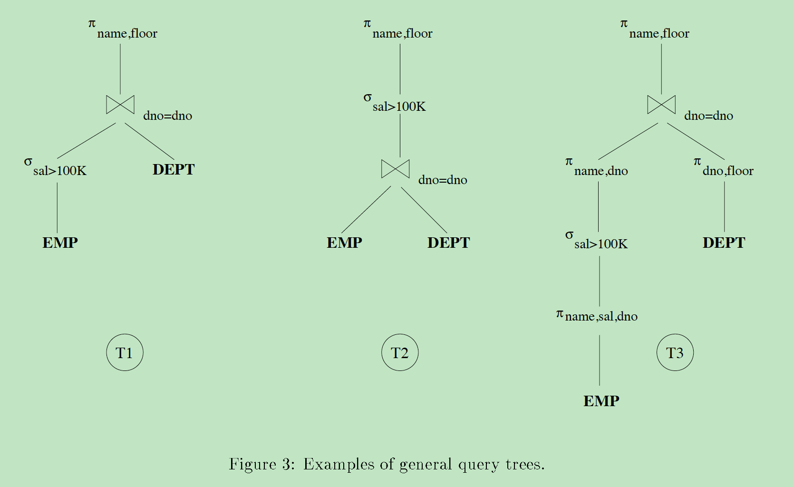
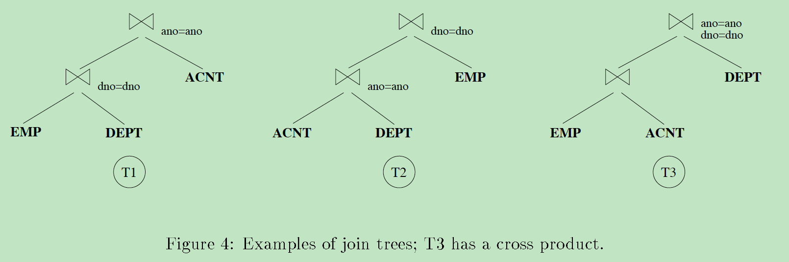
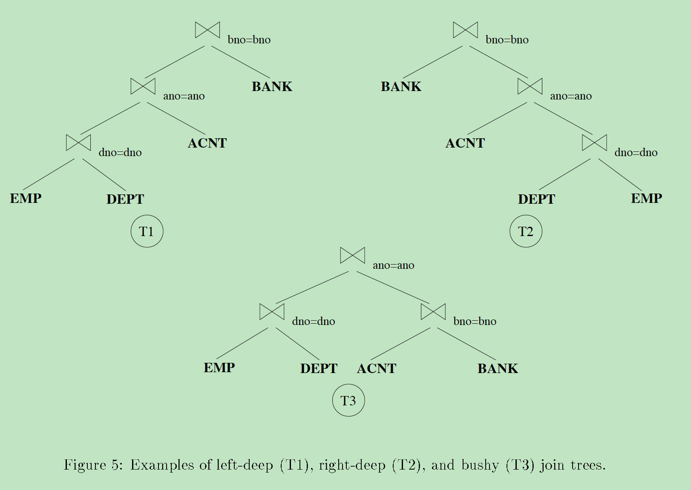

# Notes of **Query Optimization**

|时间|内容|
|:---|:---|
|2019-07-13||

<!--
Purugganan M, Hewitt J. How to read a scientific article[J]. Rice University, 2004.

IMRD structure: Introduction, Methods, Results, and Discussion.

Before and during your reading, ask yourself these questions:
• Who are these authors? What journal is this? Might I question the credibility of the work?
• Have I taken the time to understand all the terminology?
• Have I gone back to read an article or review that would help me understand this work better?
• Am I spending too much time reading the less important parts of this article?
• Is there someone I can talk to about confusing parts of this article?

After reading, ask yourself these questions:
• What specific problem does this research address? Why is it important?
• Is the method used a good one? The best one?
• What are the specific findings? Am I able to summarize them in one or two sentences?
• Are the findings supported by persuasive evidence?
• Is there an alternative interpretation of the data that the author did not address?
• How are the findings unique/new/unusual or supportive of other work in the field?
• How do these results relate to the work I’m interested in? To other work I’ve read about?
• What are some of the specific applications of the ideas presented here? What are some further experiments that would answer remaining questions?
 -->


## 引用

<!--
Author(s), Date of publication, Title (book or article), Journal,Volume #, Issue #, pages:
If web access: url; date accessed
-->

```
@Article{Ioannidis1996,
  author    = {Ioannidis, Yannis E},
  title     = {Query Optimization},
  journal   = {ACM Computing Surveys (CSUR)},
  year      = {1996},
  volume    = {28},
  number    = {1},
  pages     = {121--123},
  groups    = {Query Optimization},
  publisher = {Citeseer},
}
```

## 关键字

查询优化

## 主题

<!-- General subject, Specific subject -->

数据库查询优化

## 假设

只讨论查询优化中的核心问题和解决方案:<br/>
(1) 集中式的关系型DBMS, 感知运行时环境<br/>
(2) 优化只有AND布尔连接限定词的平坦SQL查询<br/>
conjunctive query, select-project-join query, nonrecursive Horn clause
(3) 不是完整的综述, 提供了示例; 其他综述见[JK84, MCS88]


## 方法论

## 结果

## 关键点总结

<!--
Document level
• Title
• Abstract
• Keywords
• visuals (especially figure and table titles)
• first sentence or the last 1-2 sentences of the Introduction

Paragraph level: words or phrases to look for
• surprising
• unexpected
• in contrast with previous work
• has seldom been addressed
• we hypothesize that
• we propose
• we introduce
• we develop
• the data suggest
-->

### 文章结构

```
1 Introduction 						                    - P.1
2 Query Optimizer Architecture 			          - P.5
2.1 Overall Architecture 				              - P.5
2.2 Module Functionality 				              - P.6
2.3 Description Focus 					              - P.8
3 Algebraic Space 					                  - P.9
4 Planner 						                        - P.14
4.1 Dynamic Programming Algorithms 		        - P.14
4.2 Randomized Algorithms 				            - P.19
4.3 Other Search Strategies 				          - P.21
5 Size-Distribution Estimator 			          - P.23
5.1 Histograms 						                    - P.24
5.2 Other Techniques 					                - P.26
6 Non-centralized Environments 			          - P.27
6.1 Parallel Databases 					              - P.27
6.2 Distributed Databases 				            - P.28
7 Advanced Types of Optimization 			        - P.29
7.1 Semantic Query Optimization 			        - P.29
7.2 Global Query Optimization 				        - P.30
7.3 Parametric/Dynamic Query Optimization 		- P.31
8 Summary 						                        - P.32
References 						                        - P.33
```

### 术语

- query optimization: 查询优化
- plans: 计划
- nested loop: 嵌套循环
- page-level nested loop: 页级的嵌套循环
- tuple-level formation of the cross product: 交叉积的元组级构造
- rewriting: 重写
- planning: 计划
- equivalent queries: 等价查询
- search strategy: 查询策略
- query tree: 查询树


### 摘要

无.

### 2 Query Optimizer Architecture

查询优化器逻辑架构见Figure 2: Query optimizer architecture, 组件有:

(1) Rewriter<br/>
在给定查询上应用转换操作, 生成预期更高效的等价查询, 例如用定义替换视图, 嵌套循环平坦化等<br/>
转换操作只依赖于查询的声明式静态特征, 不考虑实际查询成本<br/>
<font color="red">未深入讨论</font>.

(2) Planner<br/>
检查前一阶段生成的所有查询计划, 挑选出成本最小的用于生成原始查询的结果:<br/>
使用搜索策略, 检查执行计划空间; 执行计划空间由Algebra Space和Method-Structure Space确定;<br/>
基于估计的代价评估计划; 代价从Cost Model和Size-Distribution Estimator获取.

(3) Algebra Space<br/>
确定Planner查询计划中动作序列的执行顺序: 表示为关系代数的公式或树形式.

(4) Method-Structure Space<br/>
确定Algebra Space中指定执行动作序列的实现选择, 这些选择与可用连接方法有关: nested loop, merge scan, hash join等.<br/>
对Algebra Space的的代数公式或代数树, 生成完整的执行计划, 计划中有每个代数操作符的实现和使用索引的描述.<br/>
<font color="red">未深入讨论</font>.

(5) Cost Model<br/>
描述用于估计执行成本的算术公式, 考虑因素有: 步骤中使用的缓冲池大小、访问的关系或索引的大小、关系中值的分布等.<br/>
<font color="red">未深入讨论</font>.

(6) Size-Distribution Estimator<br/>
描述关系和索引的大小、属性值的分布和查询结果大小是如何估计的.

### 3 Algebraic Space

代数查询常表示成查询树, 叶节点为关系, 非叶节点为代数操作(选择  $\sigma$ , 投影 $\pi$ 和连接 $\Join$ ); 数据自底向上流动.

为缩小搜索策略检索的空间, 通常施加约束:

$R1$ : $\sigma$ , $\pi$ <br/>
$\sigma$ 和  $\pi$ 即时处理(on the fly)且几乎总是不会生成临时关系.<br/>
$\sigma$ 在关系首次访问时处理; $\pi$ 在生成操作符的结果时处理.

连接的属性: <br/>
可交换的(commutativity): $R_{1} \Join R_{2} \equiv R_{2} \Join R_{1}$ <br/>
可结合的(associativity): $(R_{1} \Join R_{2}) \Join R_{3} \equiv R_{1} \Join (R_{2} \Join R_{3})$

$R2$ : $\times$ (cross product) <br/>
除非查询中要求, 否则从不生成 $\times$ . 关系总是通过查询中连接组合.

$R3$ : $\Join$ <br/>
每个连接的内层操作数是关系, 从不是临时结果. <br/>
在连接内层使用原始的数据库关系的好处是: <br/>
(1) 增加已有索引的使用率 <br/>
(2) 在连接外层使用临时结果, 可以按管道(pipeline)的方式处理嵌套内层循环连接

### 4 Planner

TODO(zhoujiagen) restart here!!!
#### 4.1 Dynamic Programming Algorithms


#### 4.2 Randomized Algorithms


#### 4.3 Other Search Strategies


### 5 Size-Distribution Estimator


### 6 Non-centralized Environments


### 7 Advanced Types of Optimization


## 上下文

<!-- how this article relates to other work in the field; how it ties in with key issues and findings by others, including yourself -->

## 意义

<!-- Significance to the field; in relation to your own work -->

## 重要的图表

<!-- brief description; page number -->

### 运行实例 - P.2

表结构:

```
emp(name, age, sal, dno)
dept(dno, dname, floor, budget, mgr, ano)
acnt(ano, type, balance, bno)
bank(bno, bname, address)
```

数据库内容、结构和运行环境:

|参数|值|
|:---|:---|
|Number of emp pages<br/>Number of emp tuples<br/>Number of emp tuples with sal>100K<br/>Number of dept pages<br/>Number of dept tuples|20000<br/>100000<br/>10<br/>10<br/>100|
|Indices of emp<br/>Indices of dept|Clustered B+-tree on emp.sal(3-levels deep)<br/>Clustered hashing on dept.dno(average bucket length of 1.2 pages)|
|Number of buffer pages|3|
|Cost of one disk page access|20ms|


查询:

```
select name, floor
from emp, dept
where emp.dno=dept.dno and sal>100K.
```

计划:

P1: 通过emp的B+树索引查找emp中满足sal>100K的所有元组. 对每个元组, 使用dept的哈希索引查找相应的dept元组. (嵌套循环, 使用两个关系的索引)

cost: 0.32s

P2: 对每个dept页, 扫描整个emp关系. 如果一个emp元组与dept页中元组dno相同, 且满足emp.sal选择要求, 则该emp-dept元组对在结果中出现. (页级的嵌套循环, 不使用索引)

cost: >1h

P3: 对每个dept元组, 扫描整个emp关系, 存储所有emp-dept元组对. 然后扫描这个元组对集合, 对每个元组对检查dno是否相等和是否满足emp.sal选择要求. (交叉积的元组级构造, 后续扫描测试连接和选择)

cost: >1d

### Figure 1: Query flow through a DBMS - P.4

Query Parser: 			检查查询是否有效, 将查询翻译为内部表示(通常是关系演算表达式)
Query Optimizer: 		检查所有等价于查询的代数表达式, 挑选出代价最小的一个
Code Generator/Interpreter: 	将优化器生成的访问计划转换为对查询处理器的调用
Query Processor: 		实际执行查询



### Figure 2: Query optimizer architecture - P.6

查询优化器逻辑架构: 重写, 计划.



### Figure 3: Examples of general query trees. - P.10

运行实例的查询树

$T1$ $\pi_{\texttt{name}, \texttt{floor}}(\sigma_{\texttt{sal>100L}}(\texttt{emp}) \Join_{\texttt{dno=dno}} \texttt{dept})$

$T2$ $\pi_{\texttt{name}, \texttt{floor}}(\sigma_{\texttt{sal>100L}}(\texttt{emp} \Join_{\texttt{dno=dno}} \texttt{dept}))$

$T3$ $\pi_{\texttt{name}, \texttt{floor}}( \pi_{\texttt{name}, \texttt{dno}}(\sigma_{\texttt{sal>100L}}(\pi_{\texttt{name}, \texttt{sal}, \texttt{dno}} (\texttt{emp}))))) \Join_{\texttt{dno=dno}} \pi_{\texttt{dno}, \texttt{floor}}(\texttt{dept})))$



### Figure 4: Examples of join trees; T3 has a cross product. - P.11

```
select name, floor, balance
from emp, dept, acnt
where emp.dno=dept.dno and dept.ano=acnt.ano
```

$T3$ 有交叉积.



### Figure 5: Examples of left-deep (T1), right-deep (T2), and bushy (T3) join trees. - P.13

```
select name, floor, balance, address
from emp, dept, acnt, bank
where emp.dno=dept.dno and dept.ano=acnt.ano and acnt.bno=bank.bno
```



## 引用的重要文献

<!-- cite those obviously related to your topic AND any papers frequently cited by others because those works may well prove to be essential as you develop your own work -->

可以参考的其他综述:

[JK84] M. Jarke and J. Koch. Query optimization in database systems. ACM Computing Surveys, 16(2):111-152, June 1984.

[MCS88] M. V. Mannino, P. Chu, and T. Sager. Statistical profile estimation in database systems. ACM Computing Surveys, 20(3):192-221, September 1988.

## 其他备注

Set theory: https://en.wikipedia.org/wiki/Set_theory

Relational algebra: https://en.wikipedia.org/wiki/Relational_algebra
