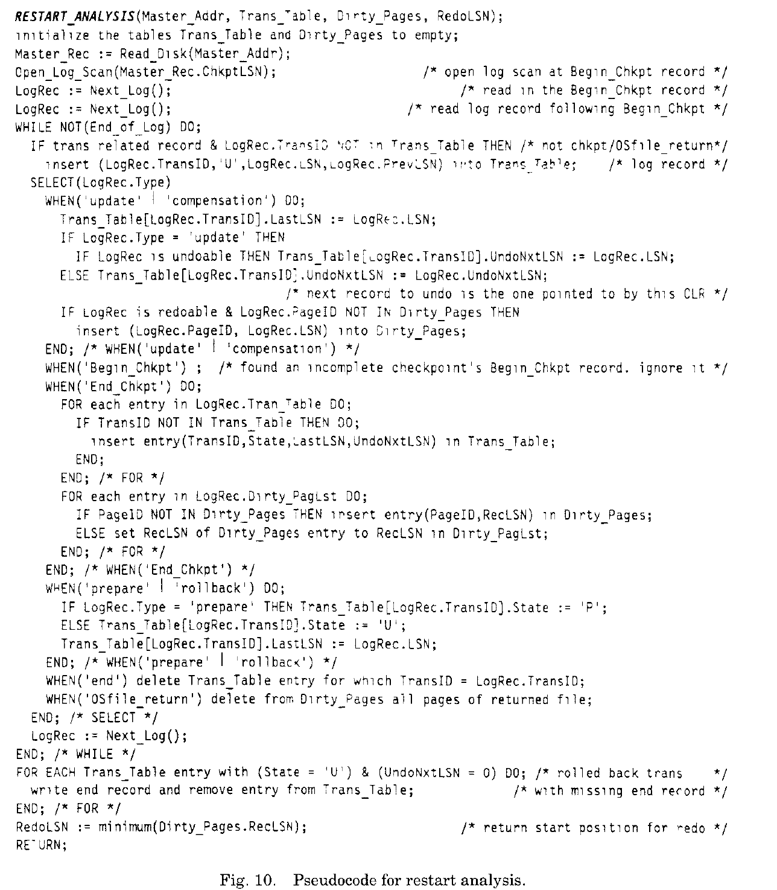

# Notes of ARIES

|时间|内容|
|:---|:---|
|2019-04-28|kick off.<br/>find ref 关系数据库是如何工作的（8）<br/>https://www.devbean.net/2016/05/how-database-works-8/ |
|2019-04-29|add 文章结构/摘要/数据结构|
|2019-04-30|add 正常处理/重启处理|
|2019-05-05|add 重启处理中选择性或之后的重启<br/>add 重启时生成检查点<br/>add 介质恢复<br/>add 嵌套的顶级动作<br/>add 恢复范式|
|2019-05-06|add 其他基于WAL的方法<br/>add ARIES的特性|

<!--
Purugganan M, Hewitt J. How to read a scientific article[J]. Rice University, 2004.

IMRD structure: Introduction, Methods, Results, and Discussion.

Before and during your reading, ask yourself these questions:
• Who are these authors? What journal is this? Might I question the credibility of the work?
• Have I taken the time to understand all the terminology?
• Have I gone back to read an article or review that would help me understand this work better?
• Am I spending too much time reading the less important parts of this article?
• Is there someone I can talk to about confusing parts of this article?

After reading, ask yourself these questions:
• What specific problem does this research address? Why is it important?
• Is the method used a good one? The best one?
• What are the specific findings? Am I able to summarize them in one or two sentences?
• Are the findings supported by persuasive evidence?
• Is there an alternative interpretation of the data that the author did not address?
• How are the findings unique/new/unusual or supportive of other work in the field?
• How do these results relate to the work I’m interested in? To other work I’ve read about?
• What are some of the specific applications of the ideas presented here? What are some further experiments that would answer remaining questions?
 -->


## 引用

<!--
Author(s), Date of publication, Title (book or article), Journal,Volume #, Issue #, pages:
If web access: url; date accessed
-->

```
@Article{Mohan1992,
  author    = {Mohan, C and Haderle, Don and Lindsay, Bruce and Pirahesh, Hamid and Schwarz, Peter},
  title     = {ARIES: a transaction recovery method supporting fine-granularity locking and partial rollbacks using write-ahead logging},
  journal   = {ACM Transactions on Database Systems (TODS)},
  year      = {1992},
  volume    = {17},
  number    = {1},
  pages     = {94--162},
  file      = {:ARIES - A Transaction Recovery Method Supporting Fine-Granularity Locking and Partial Rollbacks Using Write-Ahead Logging[1992].pdf:PDF},
  groups    = {Txn},
  publisher = {ACM},
}
```

ARIES: A Transaction Recovery Method Supporting Fine-Granularity Locking and Partial Rollbacks Using Write-Ahead Logging

一个事务恢复方法

支持: 细粒度锁, 使用WAL的部分回滚

## 关键字

Algorithms, Design, Performance, Reliability
Buffer management, latching, locking, space management, write-ahead logging(WAL)

## 主题

<!-- General subject, Specific subject -->

Operating System:
Reliability - backup procedure, checkpoint / restart, fault tolerance

Data:
Files - backup / recovery

Database Management:
Physical Design - recovery and restart
Systems - concurrency, transaction processing
Database Administration - logging and recovery


## 假设

存在3种失败原因:

(1) transaction/process 进程消失时事务在更行缓存中部分页

(2) system 虚拟内存中内容丢失

(3) media/device 介质上内容丢失

## 方法论

## 结果

## 关键点总结

<!--
Document level
• Title
• Abstract
• Keywords
• visuals (especially figure and table titles)
• first sentence or the last 1-2 sentences of the Introduction

Paragraph level: words or phrases to look for
• surprising
• unexpected
• in contrast with previous work
• has seldom been addressed
• we hypothesize that
• we propose
• we introduce
• we develop
• the data suggest
-->

### 文章结构

```
1 Introduction                                  - P.2
1.1 Logging, Failures, and Recovery Methods     - P.2
1.2 Latches and Locks                           - P.7
1.3 Fine-Granularity Locking                    - P.8
1.4 Buffer Management                           - P.10
1.5 Organization                                - P.11
2 Goals                                         - P.12
3 Overview of ARIES                             - P.16
4 Data Structures                               - P.19
4.1 Log Records                                 - P.19
4.2 Page Structure                              - P.20
4.3 Transaction Table                           - P.21
4.4 Dirty_Pages Table                           - P.21
5 Normal Processing                             - P.22
5.1 Updates                                     - P.22
5.2 Total or Partial Rollbacks                  - P.24
5.3 Transaction Termination                     - P.27
5.4 Checkpoints                                 - P.28
6 Restart Processing                            - P.29
6.1 Analysis Pass                               - P.29
6.2 Redo Pass                                   - P.31
6.3 Undo Pass                                   - P.33
6.4 Selective or Deferred Restart               - P.35
7 Checkpoints during Restart                    - P.37
8 Media Recovery                                - P.38
9 Nested Top Actions                            - P.41
10 Recovery Paradigms                           - P.42
10.1 Selective Redo                             - P.43
10.2 Rollback State                             - P.46
10.3 Space Management                           - P.49
10.4 Multiple LSNs                              - P.51
11 Other WAL-Based Methods                      - P.51
12 Attributes of ARIES                          - P.57
13 Summary                                      - P.61
13.1 Implementations and Extensions             - P.63
REFERENCES                                      - P.64
```

### 术语

- ARIES: Algorithm for Recovery and Isolation Exploiting Semantics, 利用语义发恢复和隔离算法
- LSN: Log Sequence Number, 日志序列号
- stable storage: 稳定存储
- volatile storage: 易失性存储
- foring: foring the log up to that LSN
- undo
- redo
- undo-redo log record
- redo-only log record
- undo-only log recotd
- in-place updating


- forward processing: 系统正常处理中(非重启恢复)的执行的更新, 使用日志生成(undo)更新调用记录
- partial rollback: 事务执行中设置保存点(savepoint), 后续处理中事务可以回滚到指定保存点savepoints[1, 31]
- total rollback: 事务中的所有更新被撤销, 事务终止
- nested rollback: 部分回滚后全部回滚; 或者部分回滚后继另一个回滚, 后者的结束点在前者之前
- normal undo: 系统在正常操作中的部分回滚或全部回滚
- restart undo: 系统失败后重启时的事务回滚
- compensation log records(CLRs): 补偿日志记录, 记录回滚中的更新操作

- page-oriented redo: 其中更新操作被重做的日志记录, 说明页在正常处理中被修改; 该页在重做过程中也被修改<br/>
重做更新时, 不需要访问内部的表或索引描述符, 即不需要访问其他的页
- logical redo: 索引修改未单独记录, 按数据页日志记录重做<br/>
需要访问索引树以确定需要修改的页; redo操作时修改的索引页可能与正常操作时修改的索引页不同<br/>
使用page-oriented redo可以实现对象隔离的恢复, 即恢复页中的内容不需要访问其他页

- page-oriented undo:
- logical undo: 与page-oriented undo相比, 支持更高的并发性(<font color="red">为什么?</font> 因为在合理的并发控制协议下, 一个事务中未提交的更新可以在另一个事务中移动到另一页中; 而在面向页的undo中另一个事务需要等待前一个事务提交) <br/>ARIES支持page-oriented redo和logical undo

- latch: 类似于信号量, 通常用于保证数据的物理一致性
- lock: 用于保证数据的逻辑一致性

latch消耗小是因为latch控制信息总在虚拟内存的固定位置中, 可按名称直接访问<br/>
每个事务至多持有2到3个latch, latch请求块可以在事务开始时分配;<br/>
事务哈希表中存储当前事务已持有或在申请的锁信息

- lock modes: S, X, IX, IS, SIX
- lock granularities: record/tuple, table/relation, file/tablespace
- hierarchical locking: IX/IS/SIX, high level, lower level

- 意图(intention)锁, 非意图锁的区别

非意图锁隐式的将高层对象上的锁赋予下层对象; 意图锁只是赋予下层对象请求意图锁和非意图锁的权限.

- 锁请求选项: 有条件(conditional), 无条件(unconditional)
- 锁持有周期(duration): instant, manual, commit

- 细粒度封锁(fine-granularity locking)

- BM: Buffer Manager
- fix原语: 请求数据库中逻辑页的buffer中地址; 页不在buffer中会读取页到分配的buffer slot中. 页在buffer中fix后不可被替换
- fix_new原语: (为不存在的页, 例如B+树节点分裂)分配新slot
- unfix原语: fix的逆操作
- dirty: buffer中页有未同步到非易失性存储中的修改

- BM策略(policy)

steal: 在事务提交前, 事务中对页的修改允许写到非易失性存储中<br/>
no-steal<br/>
force: 在事务中所有更新写到非易失性存储之前, 不允许提交事务<br/>
no-force<br/>
deferred updateing: 事务中不在buffer中原地更新

### 摘要

提出了ARIES(Algorithm for Recovery and Isolation Exploiting Semantics), 通过使用WAL, 支持事务部分回滚、细粒度(记录)锁和恢复.

引入可重复历史(repeatable history)场景: 在系统失败重启过程中, 执行失败的事务回滚之前, 重做(redo)所有的丢失更新.

ARIES在每个页有日志序列号, 日志序列号关联了页的状态与该页的更新日志.
事务中所有更新被记录到日志中, 包括回滚中执行的更新.
通过合理的链接回滚时的日志记录到前向处理时的日志记录, 保证回滚时、甚至在重启时重复失败或嵌套回滚时,有限数量的日志记录操作.

处理了在构建和操作业界强度的事务处理系统时很重要的一些特性.
ARIES支持模糊检查点、可选择的和延迟的重启、模糊镜像拷贝、介质恢复和高并发锁模式(例如增减), 这利用了操作的语义和需要执行操作的记录的能力.
ARIES对于多种可被实现的缓冲区管理策略是灵活的.
ARIES高效支持变长对象.
通过开启并行重启、面向页的redo和逻辑undo, ARIES提升了并发性和性能.

展示了为什么System R中的一些基于影子页技术的日志记录和恢复场景, 需要在WAL上下文中做些改变.

将ARIES与DB2、IMS、Tandem系统中基于WAL的恢复方法进行了比较.

ARIES不仅适用于数据库管理系统, 也适用于持久化面向对象语言、可恢复文件系统和基于事务的操作系统。

ARIES已在IBM OS/2扩展版数据库管理器、DB2、Workstation Data Save Facility/VM、Starburst、QuickSilver和Wisconsin大学的EXODU和Gamma数据库机器中有不同程度的实现.

### 目标

- 简单但足够灵活的算法
- 操作日志化
- 灵活的存储管理
- 支持部分回滚
- 灵活的缓冲区管理
- 独立的恢复
- 逻辑undo
- 并行和快速恢复
- 最小消耗

### 概览

CLR: redo only

执行日志记录undo操作时, CLR记录redo目的的补偿动作外, 将UndoNxtLSN指向被undo的日志记录的前继(predecessor).

UndoNxtLSN的目的是便于确定当前事务中最后的还没有被undo过的日志记录.

通过将CLR与前向处理中的日志记录链在一起, 可以保证回滚中, 甚至在重复失败或嵌套回滚时, 只需要处理有限数量的日志记录.


### 数据结构

#### 日志记录

|Field|Description|
|:---|:---|
|LSN|		日志序列号, 日志地址空间中日志记录的地址|
|Type|		日志记录类型: 补偿/正常更新/提交协议相关/非事务相关|
|TransID|		写入该日志记录的事务ID|
|PrevLSN|	同一个事务写入的前一个日志记录地址|
|PageID|		只在正常更新/补偿类型中出现|
|UndoNxtLSN|	只在补偿类型中出现|
|Data|		描述执行更新动作的redo/undo数据|


Type的取值:

- update,
- compensation: including nested top actions’ dummy CLR
- prepare, rollback, end,
- OSfile_return,
- begin_chkpt, end_chkpt

Data

- CLR只包含redo信息, 从不被undo.
- 更新信息可以以逻辑方式被记录.
- 改变页中的一些字段(例如空闲空间)不需要记录日志.
- 整个对象的undo和redo信息不需要被记录日志, 只需要记录修改的字段.
- 对于递增和递减操作, 不需要同时记录前后字段的镜像, 只需要记录操作类型和数量.
- 用于确定执行日志记录中相关的redo和undo操作的routine.

#### 页结构

page_LSN:	记录了页中最后更新的LSN

ARIES要求BM使用WAL, 但不限制缓存页替换策略(steal/no deferred or deferred)

#### 事务表(Trans_Table)

|Field|Description|
|:---|:---|
|TransID|		事务ID|
|State|		事务的提交状态: Prepared(存疑in-doubt, P), Unprepared(U)|
|LastLSN|		事务最后的日志记录的LSN|
|UndoNxtLSN|	回滚时处理的下一个日志记录的LSN. 非CLR时为LastLSN, CLR时为CLR.UndoNxtLSN|

使用:

(1) 用于重启恢复中跟踪活跃事务的状态;<br/>
(2) 在正常处理时被事务管理器使用;<br/>
(3) 如果重启中生成检查点, 表中的内容会在检查点记录中.

初始化: 在分析阶段中从最近的检查点初始化.

被修改: 分析过程中、undo阶段.


#### 脏页表(Dirty_Pages)

|Field|Description|
|:---|:---|
|PageID|		页ID|
|RecLSN|		Recovery LSN, 下一个日志记录的LSN(the current end-of-log LSN)|

实现: 哈希, 或者延迟写队列.

使用:

(1) 用于表示正常处理时的脏缓存页信息(BM中): fix后写非脏页时添加项, 页写到非易失性存储时删除项;<br/>
(2) 被用于重启恢复: 从最近的检查点记录中初始化, 分析阶段中被修改. 最小的RecLSN作为redo阶段的开始点.

### 正常处理

事务执行: 前向处理, 全部回滚, 部分回滚.

#### 更新(Updates)

锁粒度是记录, 更新页中记录的过程:

- 锁定记录;
- fix页到buffer中, latch为X模式;
- 执行更新;
- 追加更新日志记录;
- 日志记录的LSN更新到页的page_LSN和事务表;
- unlatch和unfix页.

执行索引操作时不需要持有数据页latch.
最多可以同时持有两个页latch.

所有日志记录中不一定要同时有redo和undo信息: undo only, redo only. 即更新操作需要写入多个日志.

这种情况下, 需要先写undo only日志再写redo only日志; 页的page_LSN为redo only日志的LSN.

<font color="red">为什么?</font>

(1) 只记录了redo only后, 系统崩溃, 后续找不到undo only日志, 无法撤销操作;<br/>
(2) 如果页的page_LSN为undo only日志的LSN, 但非易失性存储的页中已经有执行了redo only中的操作; 这时重启恢复中执行redo是不必要的

事务前向处理时, 存在一些redo only的日志记录, 例如:
事务准备(prepare)、空闲空间目录(inventory)更新(见10.3)等.

封锁处理: (<font color="red">为什么这里会涉及封锁?</font>)<br/>
(1) 粒度为记录<br/>
(2) 粒度为页


#### 全部或部分回滚(Rollbacks)

保存点(savepoint)

- 建立保存点时, 事务最后日志记录的LSN(SaveLSN)保存到内存中.
- 如果在事务开始处建立保存点, SaveLSN=0.
- 保存点在事务回滚到该保存点或该保存点前面的保存点时, 该保存点不再有效.

回滚中:

(1) 按逆序undo日志记录, 对每个undo操作写CLR;<br/>
(2) 忽略redo only日志.


补偿日志的作用是不强制undo操作是原始更新操作的逆. 这种抽象在涉及索引和空间管理的逻辑undo中很有用.

事务回滚时, 在savepoint后获取的锁, 可能需要在回滚完成后释放.

#### 事务结束(Termination)

假设: 使用两阶段提交协议的形式(Presumed Abort, Presumed Commit)结束事务
准备(prepare)日志记录需要和更新类型的锁(IX, X, SIX等)一起, 作为协议的一部分, 同步的写到日志中.

为什么要在日志中包含锁信息?<br/>
事务进入存疑状态时, 可以在重启恢复时重新获取这些锁, 以保护存疑事务中未提交的更新.

prepare日志记录写入后, 可以释放读锁(S, IS):<br/>
When the prepare record is written, the read locks (e.g., S and IS) could be released, if no new locks would be
acquired later as part of getting into the prepared state in some other part of the distributed transaction (at the same site or a different site).<br/>
<fint color="red">这里的new locks是与前面的read locks是一样的吗?</font>

为避免将诸如删除文件记录动作在日志中, 延迟执行动作, 直到确认事务已提交. 需要将这些pending动作记录在prepare日志中.

提交事务: 事务进入存疑状态后, 通过写入end日志记录和释放锁.<br/>
写入end日志后, 如果有pending动作, 则需要执行这些动作.<br/>
OSfile_return redo-only日志: 假设不跟事务关联, 建立checkpoint时动作不执行.

回滚事务: 事务进入存疑状态后, 通过写rollback日志记录、忽略pending动作、释放锁, 最后写end日志记录.<br/>
rollback和end日志记录是否需要同步写, 依赖于使用的两阶段提交协议类型.

不写prepared日志记录: 事务不是分布式事务, 或者是只读事务.

#### 检查点(Checkpoint)

目的: 减少系统恢复时的工作量(需要检查的日志数量, 需要读取的非易失性数据页树等)

执行: 周期, 可以异步

模糊(fuzzy)检查点: begin_chkpt, end_chkpt日志记录

end_chkpt日志记录中包含:<br/>
(1) 正常处理中的事务表<br/>
(2) 脏页表<br/>
(3) 打开对象(表空间、索引空间等)的文件映射信息, 即脏页表中有项的对象

一旦end_chkpt在稳定存储中, begin_chkpt日志记录的LSN被更新到稳定存储中固定位置的master record中.

incomplete checkpoint: begin_chkpt日志记录在稳定存储中, end_chkpt日志记录还未在稳定存储中.


### 重启处理

routine: RESTART, 参见Fig.9.

分析 => redo => undo.
更新dirty_page表.
最后执行checkpoint.

#### 分析阶段

routine: RESTART_ANALYSIS, 参见Fig.10 重启分析伪代码

#### redo阶段

routime: RESTART_REDO, 参见Fig.11 重启redo伪代码.

#### undo阶段

routine: RESTART_UNDO, 参见Fig.12 重启undo伪代码.

#### 选择性或滞后的重启

解决的问题: 减少关键数据不可用的时间.

方法: 略.

### 重启时生成检查点

可选的, 在恢复的不同阶段生成检查点: 分析阶段、redo阶段、undo阶段.

简单讨论: 略.

### 介质恢复

假设: 介质恢复操作的对象是文件或数据库空间/表空间等类型的实体(entity).

数据结构: 模糊镜像拷贝(fuzzy image copy/fuzzy archive dump)、镜像拷贝检查点(image copy checkpoint)

恢复过程: 略.

### 嵌套的顶级动作(nested top actions)

<font color="red">为什么需要?</font><br/>
不管事务最终是否提交, 需要提交事务中的一些更新.
例如: 扩展文件. 其他已提交的事务可能使用了这个事务中执行的文件扩展所生成的空间.

现有方案: top actions, 独立的事务; 原始事务与这个独立的事务之间可能产生锁冲突.

nested top actions: 事务中的一个更新序列, 一旦这个更新序列执行完毕后, 这个序列中的更新不应该被undo.

执行nested top action的步骤:<br/>
(1) 确定当前事务最近的日志记录的LSN<br/>
(2) 记录nested top action相关的undo和redo日志<br/>
(3) nested top action完成时, 写一个虚设的CLR(dummy CLR), 这个CLR的UndoNxtLSN指向(1)中的LSN.


### 恢复范式(recovery paradigms)

反例: System R中的一些在影子页技术下开发的恢复范例, 当使用WAL和需要高层次的并发时, 是不合适的.

关注的System R恢复范式:

(1) 重启恢复时, 选择性的redo;<br/>
(2) 重启恢复时, 在执行redo前执行undo;<br/>
(3) 事务回滚时, 不记录更新日志(即没有CLR);<br/>
(4) 没有索引和空间管理信息变化的日志记录;<br/>
(5) 不将页与其更新日志记录关联(即页中没有LSN).

a long comparative study, 略.

### 其他基于WAL的方法

考察系统:

- IMS: IMS Full Function(FF), IMS Fast Path(FP), [41, 42, 43, 48, 53, 76, 80, 94]
- DB2: [1, 10, 11, 12, 13, 14, 15, 19]
- Encompass: recovery algorithm, [4, 37]
- NonStop SQL: [95]
- VLM: value logging method, [88]
- OLM: operation logging method, [88]

考察点:

- buffer management
- normal checkpointing
- partitial rollbacks
- compensation log records
- log record contents
- page overhead
- log passes during start recovery
- page forces during restart
- restart checkpoints
- restrictions on data

### ARIES的特性

22 features:

1. support for finer than page-level concurrency control and multiple granularities of locking<br/>
用同一种方式支持页级和记录级的封锁
2. flexible buffer management during restart and normal processing<br/>
不限制BM的页替换策略
3. minimal space overhead: only one LSN per page<br/>
页中只添加LSN字段
4. no constraints on data to guarantee idempotence of redo or undo of logged actions<br/>
没有为保证redo或undo的幂等性需要给数据添加约束
5. actions taken during the undo of an update need not necessarily be the exact inverses of the actions taken during the original update<br/>
有CLR, undo操作不是必须为原始操作的逆操作
6. support for operation logging and novel lock modes<br/>
对页的修改可以以逻辑方式记录日志; 支持基于可交换性和其他操作属性的锁模式
7. even redo-only and undo-only records are accommodated<br/>
可以分开记录redo和undo日志记录: 先undo后redo
8. support for partial and total transaction rollback<br/>
支持部分和全部事务回滚
9. support for objects spanning multiple pages<br/>
支持跨多页的对象
10. allows files to be acquired or returned, any time, from or to the operating system<br/>
允许任意时刻获取和释放操作系统中文件
11. some actions of a transaction may be committed even if the transaction as a whole is rolled back<br/>
事务中部分动作甚至可以在事务被完全回滚时提交: nested top actions
12. efficient checkpoints(including during restart recovery)<br/>
高效的检查点机制
13. simultaneous processing of multiple transactions in forward processing and/or in rollback accessing same page<br/>
同时处理同一个页上的事务(前向处理中和/或回滚中)
14. no locking or deadlocks during transaction rollback<br/>
事务回滚时不需要封锁, 没有死锁
15. bounded logging during restart in spite of repeated failures or of nested rollbacks<br/>
因重复失败或嵌套回滚而重启时, 只需处理有限数量的日志记录
16. permits exploitation of parallelism and selective/deferred processing for faster restart<br/>
支持快速重启: 使用并行和选择性/滞后处理
17. fuzzy image copying(archive dumping) for media recovery<br/>
支持介质恢复
18. continuation of loser transactions after a system restart<br/>
支持系统重启后失败事务继续运行
19. only one backward traversal of log during restart or media recovery<br/>
重启或介质恢复时, 只需一次后向遍历
20. need only redo information in compensation log records<br/>
CLR中只需要redo信息
21. support for distributed transactions<br/>
支持分布式事务
22. early release of locks during transaction rollback and deadlock resolution using partial rollbacks<br/>
事务回滚时尽早释放锁; 使用部分回滚处理死锁

## 上下文

<!-- how this article relates to other work in the field; how it ties in with key issues and findings by others, including yourself -->

### 影子页(shadow page)技术

> https://en.wikipedia.org/wiki/Shadow_paging

一种写时拷贝(copy-on-write)技术, 避免页的原地更新. 修改页时分配影子页, 对影子页的修改与原页无影响. 当需要将对影子页的修改持久化时, 所有对原页的引用改为对影子页的引用.

缺点: 需要额外的存储空间; 对引用了原页的修改也需要通过影子页修改, 产生大量递归式样修改.


### 广泛被接受的WAL协议

被更新页的原地修改.

在被修改的数据在非易失性的存储上可以替换原版本数据前, 对数据的修改信息必须已在稳定存储中

## 意义

<!-- Significance to the field; in relation to your own work -->

提出ARIES方法, 通过使用WAL, 支持事务部分回滚、细粒度(记录)锁和恢复.

引入可重复历史(repeatable history)场景: 在系统失败重启过程中, 执行失败的事务回滚之前, 重做(redo)所有的丢失更新.

## 重要的图表

<!-- brief description; page number -->

### Fig.2 锁兼容矩阵


### Fig.3 部分回滚示例


### Fig.5 ARIES避免补偿的补偿和重复补偿的技术


### Fig.7 数据库失败时状态


虚线表示非易失性存储中页(P1, P2)的实际状态

<font color="red">为什么</font><br/>
P1最近的日志记录需要重做(随后事务提交), P2最近的日志记录不需要重做?
日志记录中对数据页的更新, 是否已经在非易失性存储中.

涉及因素:<br/>
(1) 需要将非易失性存储中页与特定日志记录关联;<br/>
(2) 检查点中记录的内容, 以确定redo开始处.<br/>

### Fig.8 回滚伪代码

```
ROLLBACK(SaveLSN, TransID);
UndoNxt := Trans_Table[TransID].UndoNxtLSN; // 事务表
WHILE SaveLSN < UndoNxt DO;
	LogRec := Log_Read(UndoNxt); // 按LSN读取日志记录
	SELECT (LogRec.Type)
		WHEN('update') DO;
			IF LogRec is undoable THEN DO;
				Page := fix&latch(LogRec.PageId, 'X'); // 缓存页操作
				Undo_Update(Page, LogRec); // undo更新
				Log_Write('compensation', LogRec.TransID, Trans_Table[TransID].LastLSN, LogRec.PageID, LogRec.PrevLSN, ..., LgLSN, Data); //写CRL
				Page.LSN := LgLSN;
				unfix&unlatch(Page);
			END;
			UndoNxt := LogRec.PrevLSN; // 找前继
		END;
		WHEN('compensation') UndoNxt := LogRec.UndoNxtLSN; // 找前继
		OTHERWISE UndoNxt := LogRec.PrevLSN
	END;
	Trans_Table[TransID].UndoNxtLSN := UndoNxt; // 更新事务表
END;
RETURN;
```


### Fig.9 重启伪代码

Master_Addr: 系统失败前, 最后一个完整checkpoint的begin_chkpt日志记录的指针

```
RESTART(Master_Addr);
Restart_analysis(Master_Addr, Trans_Table, Dirty_Pages, RedoLSN); // 分析
Restart_Redo(RedoLSN, Trans_Table, Dirty_Pages); // redo
BP Dirty_Pages table := Dirty_Pages;
remove entries for non-buffer-resident pages from BP Dirty_Pages table; // 不在缓存中驻留的页
Restart_Undo(Trans_Table); // undo
reacquire locks for prepared transactions;
checkpoint(); // checkpoint
RETURN;
```


### Fig.10 重启分析伪代码


输入参数: Master_Addr

输出参数:

- Trans_Table: 系统失败时, 存疑的(P)或未准备的(U)事务
- Dirty_Pages: 系统失败时, buffer中的脏页
- RedoLSN: redo阶段的开始点
- 日志: 系统失败前, 已完全回滚的事务上缺失的end日志记录

```
RESTART_ANALYSIS(Master_Addr, Trans_Table, Dirty_Pages, RedoLSN);
initialize the tables Trans_Table and Dirty_Pages to empty;
Master_Rec := Read_DisK(Master_Addr);
Open_Log_Scan(Master_Rec.ChkptLSN); // 从begin_chkpt日志记录处开始扫描
LogRec := Next_Log();
LogRec := Next_Log(); // 变量: 循环中日志记录

WHILE NOT(End_of_Log) DO;
  // 非chkpt/OSfile_return
  IF trans related record & LogRec.TransID NOT in Trans_Table THEN
    insert (LogRec.TransID, 'U', LogRec.LSN, LogRec.PrevLSN) into Trans_Table;

  SELECT(LogRec.Type)
    // 更新; 补偿 日志记录
    WHEN('update' | 'compensation') DO;
    	Trans_Table[LogRec.TransId].LastLSN := LogRec.LSN;

      IF LogRec.Type = 'update' THEN
        IF LogRec is undoable THEN Trans_Table[LogRec.TransID].UndoNxtLSN := LogRec.LSN;
      ELSE Trans_Table[LogRec.TransID].UndoNxtLSN := LogRec.UndoNxtLSN;

      IF LogRec is redoable & LogRec.PageID NOT IN Dirty_Pages THEN
        insert (LogRec.PageID, LogRec.LSN) into Dirty_pages;
    END;

    // 未完成的检查点开始记录
    WHEN('Begin_Chkpt') ;

    // 检查点结束日志记录
    WHEN('End_Chkpt') DO;
      FOR each entry in LogRec.Tran_Table DO; // Checkpoint中事务表
        insert entry(TransID, State, LastLSN, UndoNxtLSN) in Trans_Table;
      END;

      FOR each entry in LogRec.Dirty_PagLst DO; // Checkpoint中脏页表
        IF PageID NOT IN Dirty_Pages THEN insert entry(PageId, RecLSN) in Dirty_Pages;
        ELSE set RecLSN of Dirty_Pages entry to RecLSN in Dirty_PagLst
      END
    END;

    // 事务准备或回滚日志记录
    WHEN('prepare' | 'rollback') DO;
      IF LogRec.Type = 'prepare' THEN Trans_Table[LogRec.TransID].State := 'P';
      ELSE Trans_Table[LogRec.TransID].State := 'U';

      Trans_Table[LogRec.TransID].LastLSN := LogRec.LSN;
    END;

    // 事务终止日志记录
    WHEN('end') delete Trans_Table entry for which TransID = LogRec.TransID;

    // pending动作日志记录
    WHEN('OSfile_return') delete from Dirty_Pages all pages of returned file;
  END;

  LogRec := Next_Log();
END;

FOR EACH Trans_Table entry with (State = 'U') & (UndoNxtLSN = 0) DO;
  write end record and remove entry from Trans_Table; // 写缺失的end日志记录
END;

RedoLSN := minimum(Dirty_Pages.RecLSN);

RETURN;
```



### Fig.11 重启redo伪代码


```
RESTART_REDO(RedoLSN, Dirty_Pages);

Open_Log_Scan(RedoLSN);
LogRec := Next_Log(); // 从重启redo点开始读取日志记录

WHILE NOT(End_of_Log) DO;
  IF LogRec.Type = ('update'|'compensation') &
     LogRec is redoable &
     LogRec.PageID IN Dirty_Pages &
     LogRec.LSN >= Dirty_Pages[LogRec.PageID].RecLSN
  THEN DO;
    Page := fix&latch(LogRec.PageID, 'X');

    IF Page.LSN < LogRec.LSN THEN DO
      Redo_Update(Page, LogRec); // 执行redo更新操作
      Page.LSN := LogRec.LSN;
    END;
    ELSE Dirty_Pages[LogRec.PageID].RecLSN := Page.LSN + 1;

    unfix&unlatch(Page);
  END;

  LogRec := Next_Log();
END;
RETURN;
```


### Fig.12 重启undo伪代码


```
RESTART_UNDO(Trans_Table);

WHILE EXISTS(Trans with State = 'U' in Trans_Table) DO;
  UndoLSN := maximum(UndoNxtLSN) from Trans_Table entries with State = 'U';
  LogRec := Log_Read(UndoLSN);

  SELECT(LogRec.Type)
    // 更新
    WHEN('update') DO;
      IF LogRec is undoable THEN DO;
        Page := fix&latch(LogRec.PageID, 'X');
        Undo_Update(Page, LogRec); // 执行undo更新
        // 写CLR, LgLSN为CLR的LSN
        Log_Write('compensation', LogRec.TransID, Trans_Table[LogRec.TransID].LastLSN,
                  LogRec.PageID, LogRec.PrevLSN,...,LgLSN, Data);
        Page.LSN := LgLSN;
        Trans_Table[LogRec.TransID].LastLSN := LgLSN;
        unfix&unlatch(Page);
      END;
      ELSE; // 日志记录不可undo, 忽略

      Trans_Table[LogRec.TransID].UndoNxtLSN := LogRec.PrevLSN;

      IF LogRec.PrevLSN = 0 THEN DO; // 事务完全被undo
        Log_Write('end', LogRec.TransID, Trans_Table[LogRec.TransID].LastLSN,...);
        delete Trans_Table entry where TransID = LogRec.TransID;
      END;
    END;

    // 补偿
    WHEN('compensation') Trans_Table[LogRec.TransID].UndoNxtLSN := LogRec.UndoNxtLSN;

    // 回滚或存疑
    WHEN('rollback'|'prepare') Trans_Table[LogRec.TransID].UndoNxtLSN := LogRec.PrevLSN;
  END;
END;

RETURN;
```


### Fig.13 恢复场景中使用ARIES示例


所有日志记录描述了同一个页上的更新操作.

失败之前, 页在日志记录2之后3之前写入磁盘.
页写入磁盘之后执行了部分回滚: 4’和3’(4和3的undo).
接着事务前向处理: 5、6.

系统失败.

redo阶段: 磁盘页上丢失的更新3、4、4‘、3’、5、6被redo.

undo阶段: 更新6、5、2、1被undo.

## 引用的重要文献

<!-- cite those obviously related to your topic AND any papers frequently cited by others because those works may well prove to be essential as you develop your own work -->

WAL对影子页的优势: [31, 97]

ARIES/LHS: [59]
ARIES/LHS: A concurrency control and recovery method using write-ahead logging for linear hashing with separators

ARIES/IM: [62]
ARIES/lM: An Efficient and High Concurrency Index Management Method Using Write-Ahead Logging
B+树索引中的并发控制和恢复

利用数据上操作的语义发明新的并发控制和恢复方法: [2, 26, 38, 88, 89]

缓冲管理器BM: [8, 15, 24, 96]

savepoint: [1, 31]

两阶段提交协议: [63, 64]

重启恢复时允许新事务处理: [60]

## 其他备注

(1) 有哪些导致事务回滚的原因?<br/>
由系统或应用触发<br/>
死锁, 错误条件, 违背引用完整性, 未预期的数据库状态等

(2) 需要考虑的边界性问题:<br/>
分开记录redo和undo日志时, 先记录undo后记录redo: 更新(Updates)<br/>
封锁协议: 部分见更新(Updates)

(3) 日志记录有哪些类型? 哪些可以redo? 哪些可以undo? 日志记录中内容如何定义?<br/>
见日志记录
